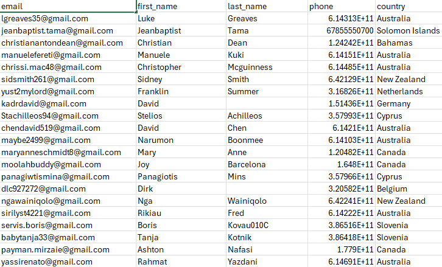
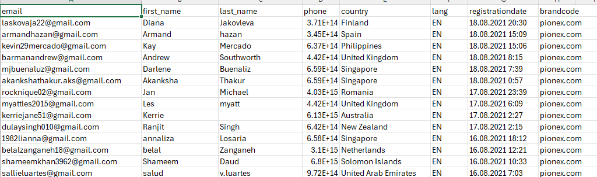

                                             

Data Cleaning Script for CSV Data

This script processes and cleans a CSV file containing user data by validating email addresses and phone numbers, normalizing and formatting names, and separating valid data from invalid or incomplete entries. The clean data is saved to one CSV file, while the garbage data (containing invalid entries) is saved to another.

Requirements
Python 3.x
pandas library
You can install the required libraries with:

bash
Copy code
pip install pandas
Files
Input File: /content/241k-Singapore-pionex.com-Crypto-Trading-Bots-UsersDB-csv-2023.csv
Clean Output File: /content/clean_data.csv
Garbage Output File: /content/garbage_data.csv
Merged Clean Output: /content/merged_clean_data.csv
Merged Garbage Output: /content/merged_garbage_data.csv
Script Overview
The script reads the input file in chunks, processes each chunk to clean and validate the data, and saves the results to separate files for clean and garbage data.

Steps Performed by the Script
File Setup and Column Definitions:

Specifies paths for input and output files.
Defines columns_to_drop (columns to be removed) and essential_columns (required fields).
Renames columns firstname and lastname to first_name and last_name.
Email Validation Function:

Validates email addresses using regular expressions.
Data Processing:

Reads the input CSV file in chunks of 10,000 rows for efficient processing.
Converts all column headers to lowercase and renames specific columns.
Keeps a copy of the data before dropping columns to help identify garbage rows.
Name Capitalization:

Capitalizes the first letter of each name in first_name and last_name.
Phone Number Cleaning and Validation:

Strips whitespace and removes non-numeric characters from phone numbers.
Validates that phone numbers have a length between 7 and 15 digits.
Separating Clean and Garbage Data:

Defines garbage data as rows with invalid email or phone numbers, missing essential data, or all NaN values.
Appends valid rows to clean_data and invalid rows to garbage_data.
Save and Print Results:

Merges all chunks into final merged_clean_data and merged_garbage_data.
Saves clean and garbage data to separate CSV files, both chunk-wise and merged.
Output Files
clean_data.csv and merged_clean_data.csv: Contain only valid data.
garbage_data.csv and merged_garbage_data.csv: Contain rows with invalid or missing data, as well as extra columns retained from columns_to_drop for traceability.
Running the Script
Run this script in a Python environment, such as Google Colab, where file paths are set up correctly. It will automatically output the cleaned and garbage data files in the specified locations.

Sample Code Output
python
Copy code
Cleaned data:
<display of merged_clean_data head>

Garbage data:
<display of merged_garbage_data head>

Cleaned data saved to: /content/clean_data.csv
Garbage data saved to: /content/garbage_data.csv
Merged clean data saved to: /content/merged_clean_data.csv
Merged garbage data saved to: /content/merged_garbage_data.csv
Notes
Ensure the input file path is correctly specified.
columns_to_drop data is retained in the merged_garbage_data.csv to provide context for invalid entries.
To modify chunk size, adjust chunksize in pd.read_csv() as needed.
This README provides a comprehensive overview of the code, explaining each step and detailing the resulting files and their contents.

A snippet of the merged cleaned data csv:

 

A snippet of the merged garbage data csv:

